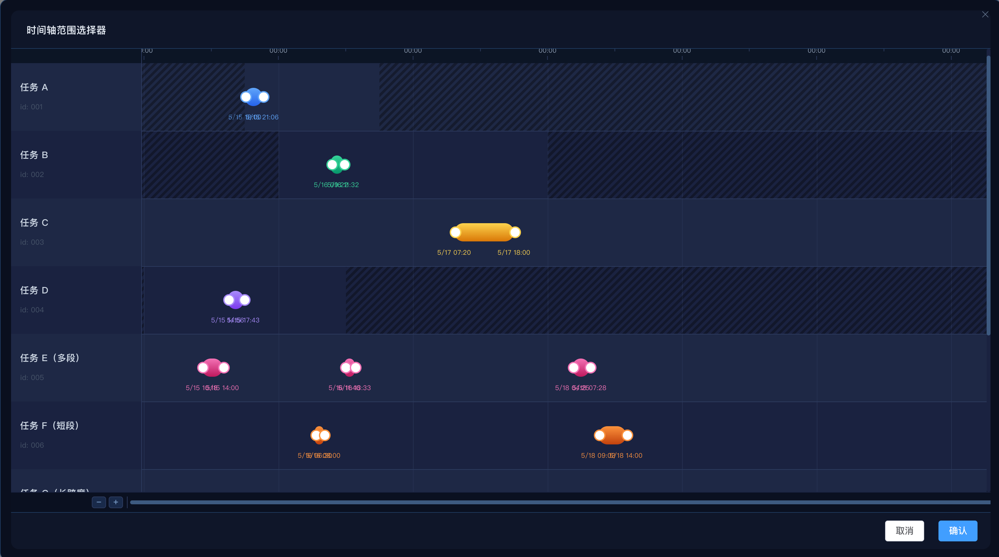
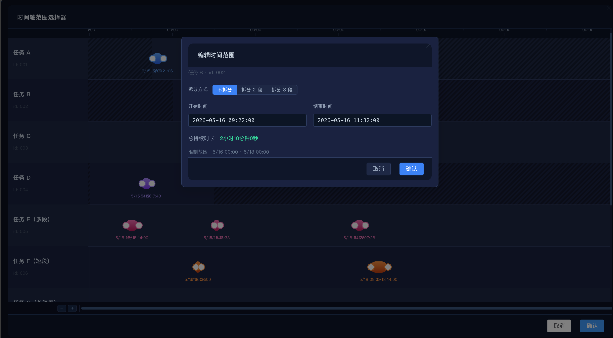
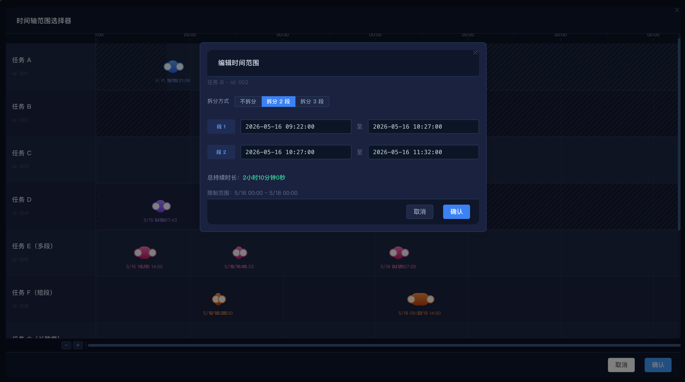

# TimeLine 甘特时间轴组件

基于 Vue 3 + TypeScript + Element Plus 的深色主题甘特时间轴弹窗组件，支持多任务多段拖拽编辑、时间范围约束和脏数据检测。







## 功能

- 深色主题甘特图，多任务多段时间条
- 拖拽段左右边缘缩放、整体平移
- 鼠标滚轮缩放视口，底部缩略导航条平移
- 每分钟磁吸对齐，自适应刻度标签
- 段重叠检测与徽标提示
- 内嵌编辑弹窗：精确输入时间、支持 2/3 段拆分
- 每任务可配置 `limit` 约束范围，超出区域显示斜线遮罩并阻止拖拽
- `isDirty` 检测：confirm 时输出各任务相对初始值是否有改动
- 所有时间戳均以 **Unix 毫秒（ms）** 为单位输入输出

## 安装依赖

```bash
pnpm install
```

## 开发 / 构建

```bash
pnpm dev      # 启动开发服务器 (localhost:5173)
pnpm build    # 生产构建
```

## 用法

```vue
<script setup lang="ts">
import { ref } from 'vue'
import TimeLine from './components/TimeLine.vue'
import { type TimeTask, type TaskResult } from './components/timeline-types'

const visible = ref(false)

const tasks: TimeTask[] = [
  {
    id: 'task-1',
    name: '任务 A',
    color: '#60A5FA',
    colorEnd: '#2563EB',
    segments: [
      { startTime: 1778839200000, endTime: 1778925600000 },
    ],
    // 可选：限制可编辑范围（Unix ms）
    limit: { startTime: 1778774400000, endTime: 1778947200000 },
  },
]

function onConfirm(result: Record<string, TaskResult>) {
  for (const [id, r] of Object.entries(result)) {
    console.log(id, r.segments, r.isDirty)
  }
}
</script>

<template>
  <button @click="visible = true">打开时间轴</button>
  <TimeLine
    v-model="visible"
    :tasks="tasks"
    @confirm="onConfirm"
  />
</template>
```

## Props

| Prop | 类型 | 默认值 | 说明 |
|------|------|--------|------|
| `v-model` | `boolean` | `false` | 控制弹窗显示/隐藏 |
| `tasks` | `TimeTask[]` | 必填 | 任务数组，时间戳均为 Unix ms |
| `trackDirty` | `boolean` | `true` | 是否在 confirm 结果中输出 `isDirty` |
| `enforceLimit` | `boolean` | `true` | 是否启用每任务的 `limit` 范围约束 |

## 事件

| 事件 | 载荷类型 | 触发时机 |
|------|---------|---------|
| `confirm` | `Record<string, TaskResult>` | 点击外层弹窗「确认」按钮 |

## 类型定义

```typescript
/** 时间原点：2026-05-15 00:00:00 本地时间 */
export const ORIGIN: number

export interface TimeSegment {
  startTime: number  // Unix ms
  endTime: number    // Unix ms
}

export interface TimeTask {
  id: string
  name: string
  color: string      // 渐变起始色（CSS 颜色值）
  colorEnd: string   // 渐变结束色
  segments: TimeSegment[]
  limit?: TimeSegment  // 可选：该任务可编辑的时间范围约束（Unix ms）
}

export interface TaskResult {
  segments: [number, number][]  // 各段 [startMs, endMs]
  isDirty: boolean               // 相对于打开时是否有改动
}
```

## 关闭功能

两个可选功能均默认开启，可通过 prop 单独关闭：

```vue
<!-- 关闭 isDirty 检测：confirm 结果中 isDirty 始终为 false -->
<TimeLine v-model="visible" :tasks="tasks" :track-dirty="false" @confirm="onConfirm" />

<!-- 关闭 limit 约束：忽略任务的 limit 字段，斜线遮罩不显示，拖拽不受范围限制 -->
<TimeLine v-model="visible" :tasks="tasks" :enforce-limit="false" @confirm="onConfirm" />

<!-- 同时关闭两者 -->
<TimeLine v-model="visible" :tasks="tasks" :track-dirty="false" :enforce-limit="false" @confirm="onConfirm" />
```

> **注意**：这两个 prop 类型为 `boolean`，Vue 3 存在 boolean casting 行为——缺省时会被转成 `false` 而非 `undefined`，因此组件内部通过 `withDefaults` 将默认值显式设为 `true`。直接写 `:track-dirty` / `:enforce-limit`（不带值）等价于传 `true`，行为与缺省一致。

## limit 约束说明

为任务设置 `limit` 字段后（且 `enforceLimit` 为 `true`）：

- 超出约束范围的区域显示斜线遮罩，视觉上标记为禁区
- 拖拽边缘或整体移动不可超出 `limit` 边界
- 内嵌编辑弹窗顶部显示当前任务的约束范围

```typescript
// 任务 A 只能在 5/15 00:00 ~ 5/17 00:00 内编辑
{
  id: 'task-1',
  limit: {
    startTime: new Date(2026, 4, 15).getTime(),   // 5/15 00:00
    endTime:   new Date(2026, 4, 17).getTime(),   // 5/17 00:00
  },
}
```

## isDirty 说明

`trackDirty`（默认 `true`）开启时，每次弹窗打开会对各任务的当前 segments 取快照。点击「确认」时，与快照比对并在 `TaskResult.isDirty` 中返回结果：

- 拖拽、编辑过任务段 → `isDirty: true`
- 未做任何改动直接确认 → `isDirty: false`
- 点击「取消」关闭弹窗时，所有修改丢弃，不触发 confirm

## 技术栈

- Vue 3.5 + `<script setup>` + TypeScript
- Element Plus 2.9（ElDialog）
- Vite 8 + vue-tsc
